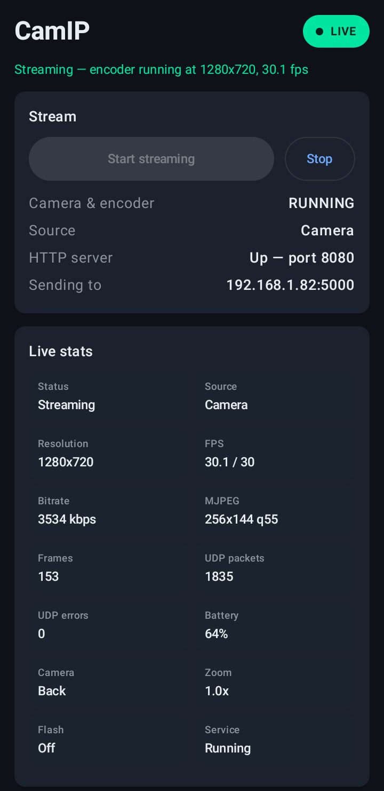
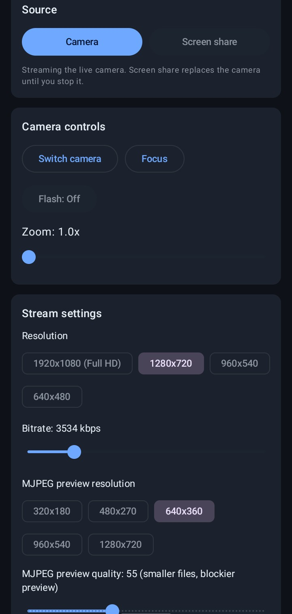
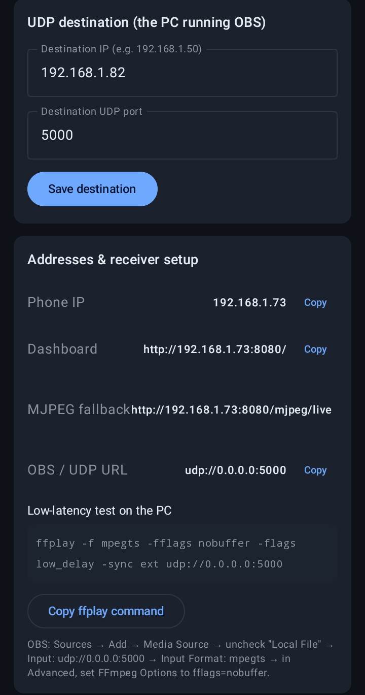
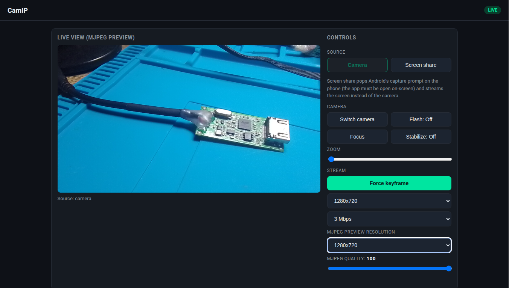
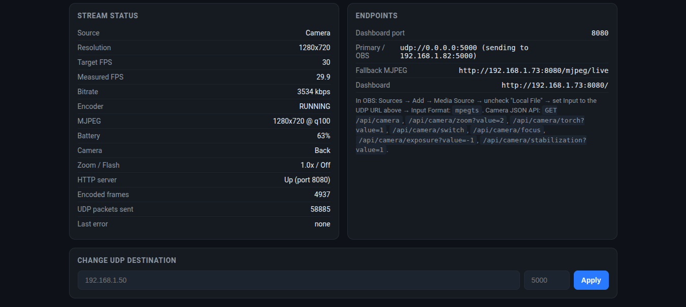
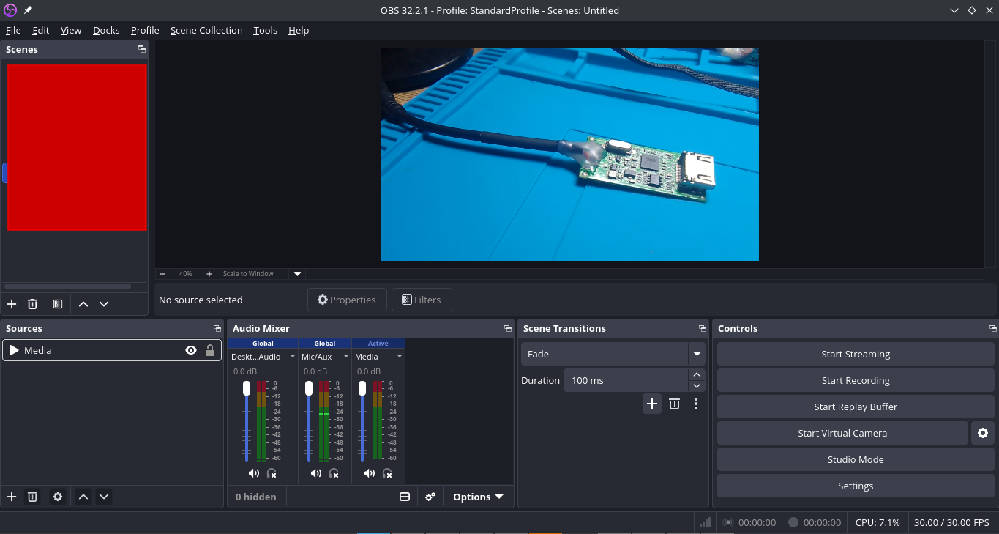

# CamIP

**Turn any Android phone into a low-latency IP camera for OBS, ffplay, or any NLE.**

CamIP encodes H.264 in hardware on the device and streams MPEG-TS over UDP to your PC. A built-in web dashboard plus an MJPEG fallback stream let you aim, focus, zoom, and configure everything from the computer while the stream is live — no cloud, no accounts, no extra binaries on the phone.

> **Attribution**  
> This application was generated by **MiMo-V2.6-Flash** on **OpenCode**.  
> README revised and polished by **Grok** (xAI).

---

## Screenshots

### Android app

| Main controls | Streaming status | Screen-share & settings |
|:-------------:|:----------------:|:-----------------------:|
|  |  |  |

### Web dashboard (open `http://<phone-ip>:8080` on your PC)

| Live preview + controls | Detailed status & camera API |
|:-----------------------:|:----------------------------:|
|  |  |

### OBS / PC receiver



---

## Architecture

```
  ┌───────────────────────────── your LAN ─────────────────────────────┐
  │                                                                    │
  │   Android phone (CamIP)                      PC (OBS / ffplay)     │
  │  ┌──────────────────────┐    UDP :5000      ┌──────────────────┐    │
  │  │ Camera2 ─► MediaCodec│ ────────────────► │ Media Source     │    │
  │  │   or                 │  H.264 in MPEG-TS │ (mpegts, nobuffer)│   │
  │  │ MediaProjection ─►   │                   └──────────────────┘    │
  │  │   screen capture     │   HTTP :8080      ┌──────────────────┐    │
  │  │ MjpegFrameSource ────┼ ────────────────► │ Web dashboard +  │    │
  │  │ (JPEG preview)       │  /  and /mjpeg/*  │ camera JSON API  │    │
  │  └──────────────────────┘                   └──────────────────┘    │
  └────────────────────────────────────────────────────────────────────┘
```

---

## Features

- **Hardware H.264 over UDP** — Camera2 → MediaCodec → custom MPEG-TS muxer → UDP socket. Zero third-party video libraries, no FFmpeg binaries on the phone, fully offline.
- **Resolution presets** — 1920×1080 (Full HD), 1280×720, 960×540, 640×480 — switchable live without stopping the stream.
- **Screen share** — mirror the entire phone screen (apps, browser, games) via Android’s MediaProjection API using the same low-latency pipeline.
- **Adjustable MJPEG quality** — 30–100 slider (persisted, applies live) plus selectable preview resolution (320×180 … 1280×720).
- **Side-by-side web dashboard** — live MJPEG preview and all controls sit next to each other (stacked on narrow screens). Zoom, focus, torch, exposure, camera switch, and more while watching the result.
- **Camera JSON API** — full remote control over HTTP (`/api/camera/...` and `/api/control`).
- **OBS-ready** — standard MPEG-TS over UDP plus a ready-to-paste low-latency `ffplay` command for quick testing.

---

## Quick start

1. **Download the APK** from the [Releases](https://github.com/proot411/CamIP/releases) page (recommended), *or* build it yourself (see [Building](#building)).
2. Install on your phone and open CamIP. Grant camera (and optionally screen-capture) permission.
3. Set the **Destination IP** to your PC’s LAN address and port (default `5000`).
4. Tap **Start**.
5. On the PC open the dashboard at `http://<phone-ip>:8080` **or** add a Media Source in OBS:

   ```
   Input: udp://0.0.0.0:5000
   Input Format: mpegts
   Network Buffering: 0 / low-latency flags
   ```

   Or test instantly with:

   ```sh
   ffplay -fflags nobuffer -flags low_delay -probesize 32 -analyzeduration 0 \
          -f mpegts udp://0.0.0.0:5000
   ```

---

## How it works

### Streaming pipeline

1. **Capture** — `CameraManager` opens a Camera2 device (or MediaProjection for screen share) and feeds two targets:
   - the encoder’s input Surface (full resolution, primary path), and
   - `MjpegFrameSource` (lower-resolution YUV → JPEG for the preview/fallback stream).
2. **Encode** — `H264Encoder` configures MediaCodec in surface-input mode, requests periodic keyframes, and emits Annex-B NAL units.
3. **Mux** — `MpegTsMuxer` wraps the H.264 elementary stream into MPEG-TS packets (PSI tables + PES).
4. **Send** — `UdpStreamer` pushes the TS packets to the configured destination over plain UDP.
5. **Serve** — a lightweight embedded HTTP server on port 8080 delivers:
   - the interactive HTML dashboard,
   - continuous MJPEG at `/mjpeg`,
   - JSON status & control endpoints.

All of the above (HTTP server, MJPEG, TS muxer, UDP sender) are implemented in pure Kotlin inside the repo — fully auditable, no native binaries required.

### Settings

| Setting | Where | Notes |
| --- | --- | --- |
| Destination IP/port | App, dashboard | Where UDP MPEG-TS is sent. Validated IPv4/port, persisted. |
| Resolution | App chips, dashboard | `1920x1080`, `1280x720`, `960x540`, `640x480`. Rebuilds the encoder stage live. |
| Bitrate | App slider, dashboard | 1.5–12 Mbps, persisted. Applied live via `PARAMETER_KEY_VIDEO_BITRATE`. |
| Keyframe interval | App slider | 1–5 s; applies on next start. *Force keyframe now* triggers one on demand. |
| MJPEG quality | App / dashboard slider | 30–100 (default 80), persisted, applies immediately to preview frames. |
| MJPEG preview resolution | App chips, dashboard | `320x180` … `1280x720` (default `640x360`). Rebuilds the live stage. |
| Source | App *Source* card, dashboard buttons | `Camera` (default) or `Screen share`. |

All settings are persisted with Jetpack DataStore (`model/AppSettings.kt`).

### Screen share

- **Start:** tap *Screen share* in the app or the dashboard button. Android’s system consent dialog appears **on the phone** (cannot be granted remotely).
- **Stop:** *Camera* button, dashboard `screen_share=0`, or the system “Stop casting” tile — all restore the camera stage automatically.
- **Sizing:** encoder keeps the selected preset’s pixel budget while preserving the real screen aspect ratio.
- Keep the screen on; CamIP holds a wake lock while sharing.

---

## HTTP API

Base URL: `http://<phone-ip>:8080`

### Status

```http
GET /api/status
```

Returns a JSON object with streaming state, measured FPS, bitrate, battery, zoom, active camera, last error, etc.

### Control

```http
GET|POST /api/control?action=<action>&value=<value>
```

| Action | Value | Effect |
| --- | --- | --- |
| `zoom` | float `1..max_zoom` | Digital zoom |
| `flash` | `1`/`0` | Torch on/off |
| `switch_camera` | — | Flip front/back |
| `focus` | — | One-shot autofocus |
| `bitrate` | `1500..12000` | Live bitrate (kbps) |
| `resolution` | `1920x1080` etc. | Rebuild encoder |
| `keyframe` | — | Force keyframe |
| `mjpeg_quality` | `30..100` | Preview quality |
| `mjpeg_resolution` | `320x180`…`1280x720` | Preview size |
| `exposure` | integer | AE compensation |
| `stabilization` | `1`/`0` | Video stabilization |
| `screen_share` | `1`/`0` | Start/stop screen share |
| `udp_destination` | `ip`, `port` | Redirect stream |

### Camera endpoints

| Endpoint | Description |
| --- | --- |
| `GET /api/camera` | Full camera state + capabilities |
| `GET\|POST /api/camera/zoom?value=2` | Digital zoom |
| `GET\|POST /api/camera/torch?value=1` | Torch |
| `GET\|POST /api/camera/switch` | Flip camera |
| `GET\|POST /api/camera/focus` | Autofocus |
| `GET\|POST /api/camera/exposure?value=-2` | Exposure compensation |
| `GET\|POST /api/camera/stabilization?value=1` | Stabilization |

---

## Troubleshooting

- **No picture in OBS / ffplay** — confirm the phone is streaming (status LED / dashboard), the destination IP/port match, and the PC firewall allows UDP on that port. Try the `ffplay` command above first.
- **Dashboard unreachable** — phone and PC must be on the same LAN; check the phone IP shown in the app.
- **Screen share consent fails** — the system dialog only appears while the CamIP activity is visible. Use the in-app button if the remote request times out.
- **Frozen screen-share frame** — keep the phone display on (CamIP already acquires a wake lock).
- **Blocky preview** — raise *MJPEG quality* or choose a larger preview resolution (affects only the MJPEG path, never the H.264 stream).
- **Smeared motion** — increase bitrate; 1080p typically wants 6–10 Mbps.
- **High latency** — use the low-latency receiver flags shown in the Quick-start section; they account for most of the perceived delay.

---

## Building

> **Prefer a pre-built APK?** Grab the latest release from the [Releases](https://github.com/proot411/CamIP/releases) page — no Android SDK required.

**Prerequisites (if building from source):** JDK 17, Android SDK 34.

Create or edit `local.properties`:

```properties
sdk.dir=/path/to/Android/Sdk
```

```sh
./gradlew assembleDebug      # APK → app/build/outputs/apk/debug/
./gradlew lintDebug          # should report 0 errors
```

Install:

```sh
adb install -r app/build/outputs/apk/debug/app-debug.apk
```

**Stack:** Kotlin 1.9 / AGP 8.5 / Jetpack Compose (Material 3), Camera2, MediaCodec, MediaProjection, Jetpack DataStore.  
No third-party networking or video libraries — the HTTP server, MJPEG endpoint, MPEG-TS muxer and UDP sender are all implemented in-repo and fully auditable.

---

## Project layout

```
app/src/main/java/com/camip/app/
├── camera/      Camera2 wrapper + MJPEG (YUV→JPEG) frame source
├── encoder/     MediaCodec H.264 surface-input encoder, Annex-B parsing
├── model/       Settings (DataStore) + StreamState (StateFlow)
├── service/     StreamService: pipeline lifecycle, screen-share stage
├── server/      HTTP server, MJPEG endpoint, dashboard HTML, control bridge
├── stream/      MPEG-TS muxer + UDP sender
└── ui/          Compose UI, screen-capture consent trampoline
```

---

## Notes & limitations

- Verified by clean `assembleDebug` + `lintDebug` (0 errors). Device-specific encoder quirks have defensive fallbacks but may need tuning on unusual hardware.
- Audio is not captured or streamed (video only).
- MPEG-TS over plain UDP is fire-and-forget: on a lossy Wi-Fi link you may see occasional macroblocking until the next keyframe — the classic latency/reliability trade-off.

---

## License & credits

App generated by **MiMo-V2.6-Flash** on OpenCode.  
README revised by **Grok** (xAI) for clarity, structure, and inclusion of demo screenshots.
